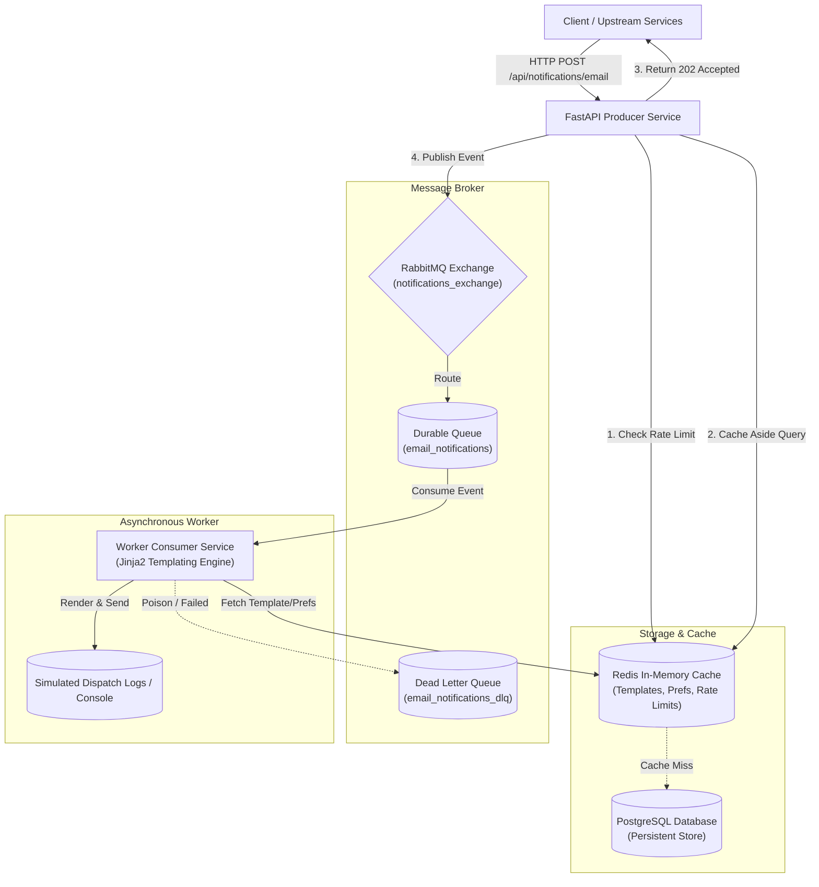
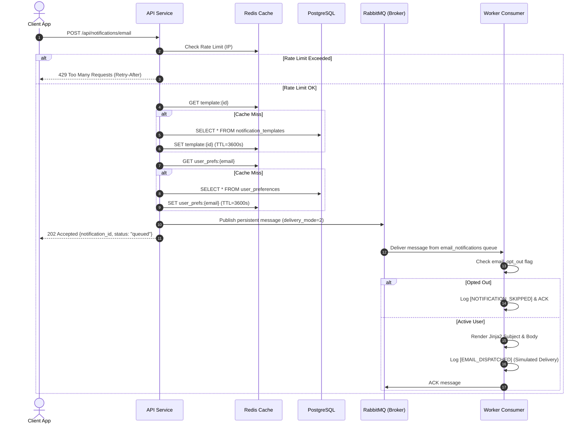

# NotifyFlow System Architecture & Design Document

## 1. Executive Summary

**NotifyFlow** is an enterprise-grade, event-driven transactional email notification service designed for high throughput, sub-millisecond API responsiveness, and fault-tolerant message processing. The system completely decouples notification ingestion from the simulated delivery pipeline by leveraging **RabbitMQ** as an AMQP message broker, **Redis** as a distributed caching and rate-limiting tier, and **PostgreSQL** for persistent relational storage.

---

## 2. High-Level System Architecture

---

## 3. Core Architectural Principles

### 3.1 Asynchronous Non-Blocking Execution
- **Zero Delivery Latency for Clients**: The API service validates payloads and queues the event to RabbitMQ within milliseconds, returning an `HTTP 202 Accepted` response immediately. Upstream clients are never blocked waiting for email rendering or network I/O.

### 3.2 Cache-Aside (Lazy Loading) Strategy
- **Notification Templates**: Cached under `template:<template_id>` with configurable TTL (default 1 hour). Eliminates database reads for high-frequency transactional templates (e.g., order confirmations, password resets).
- **User Preferences**: Cached under `user_prefs:<recipient_email>` with configurable TTL. Prevents repetitive user lookup queries during bursts.
- **Cache Invalidation**: Mutation endpoints (`PUT /api/templates/{id}`, `DELETE /api/templates/{id}`, `PUT /api/preferences/{email}`) automatically update or invalidate Redis keys to ensure consistency.

### 3.3 Sliding Window Rate Limiting
- Enforced per client IP address via Redis atomic operations (`INCR` + `EXPIRE`).
- Emits standard rate limiting headers (`X-RateLimit-Limit`, `X-RateLimit-Remaining`, `X-RateLimit-Reset`).
- Returns `HTTP 429 Too Many Requests` with a `Retry-After` header when thresholds are exceeded.

---

## 4. End-to-End Sequence Diagrams

### 4.1 Transactional Email Ingestion & Processing

---

## 5. Message Broker Design & Fault Tolerance

### 5.1 Durability & Persistence
- **Exchanges & Queues**: Declared with `durable=True`, ensuring broker restart survival.
- **Messages**: Published with `DeliveryMode.PERSISTENT` (`delivery_mode=2`) and stored to disk before acknowledgment.
- **Consumer Acknowledgments**: Worker processes messages with explicit manual acknowledgments only after successful processing.

### 5.2 Poison Message Handling & Dead-Letter Routing
- Unhandled or corrupted payloads are caught in protective `try-except` blocks.
- Failed messages are acknowledged and routed to the Dead Letter Exchange (`notifications_dlx`) and Dead Letter Queue (`email_notifications_dlq`) rather than re-queued in an infinite crash loop.

---

## 6. Scalability & Deployment Considerations

1. **Horizontal Scaling of API & Workers**:
   - The API is completely stateless and can scale horizontally behind an NGINX or cloud load balancer.
   - Workers can scale dynamically based on RabbitMQ queue depth metrics (`x-max-priority`, message count).
2. **Redis Cluster / Sentinel Support**:
   - Cache service supports distributed Redis clustering for high-availability setups.
3. **Database Connection Pooling**:
   - Asynchronous SQLAlchemy connection pooling (`asyncpg`) manages connection recycling and prevents connection exhaustion.
