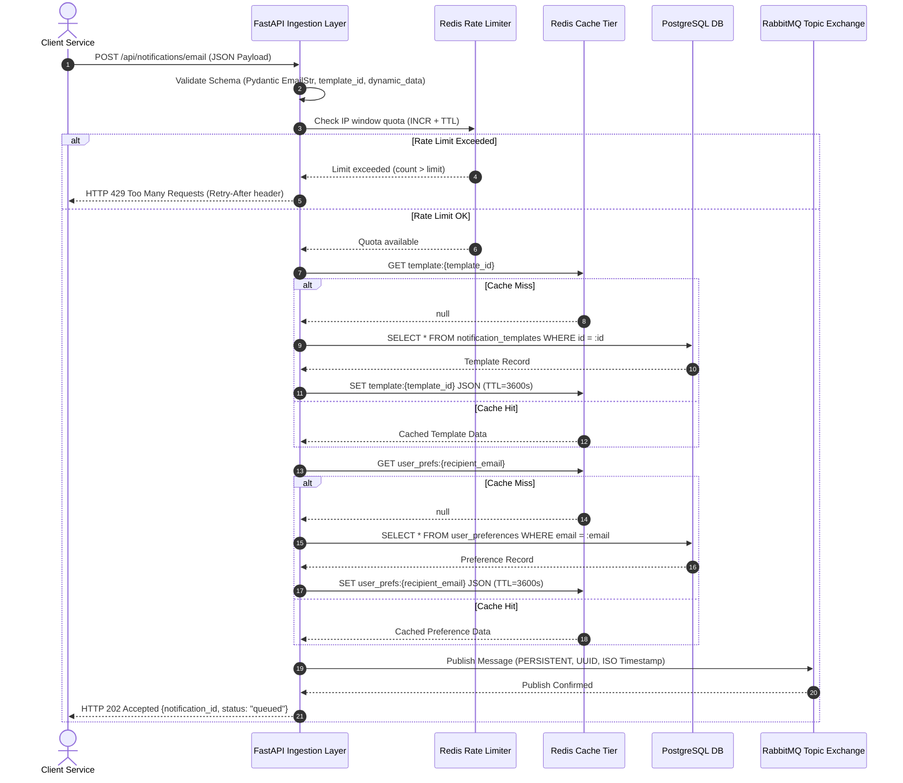
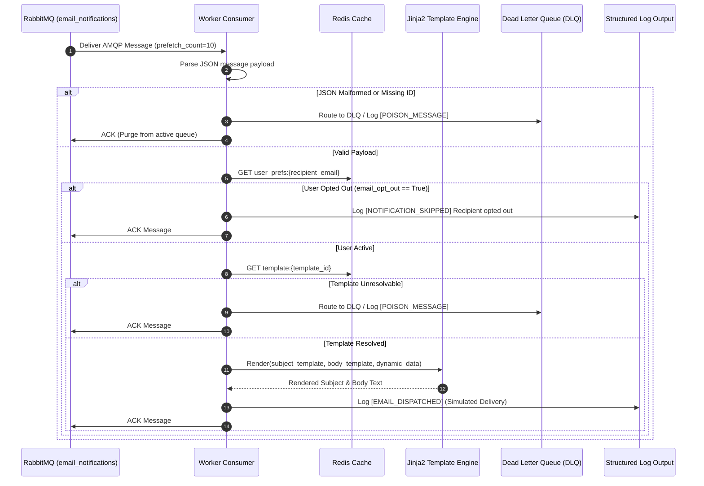
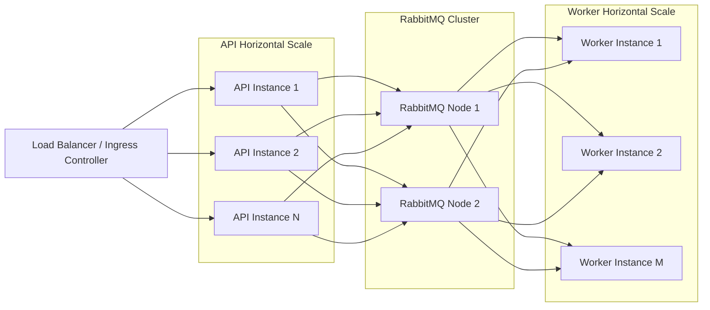

# System Architecture & Technical Design Document

## 1. Executive Summary & Objective

**NotifyFlow** is an enterprise-grade, event-driven transactional email notification service designed for high-throughput, low-latency API responsiveness, and fault-tolerant message processing. The service decouples the synchronous ingestion of notification requests from asynchronous template rendering, preference evaluation, and simulated email delivery.

### Primary Objectives:
- **Zero-Blocking Ingestion**: Eliminate upstream API latency by accepting notification requests and enqueuing them onto **RabbitMQ** within single-digit milliseconds (`HTTP 202 Accepted`).
- **High-Performance Caching**: Utilize **Redis** to eliminate redundant database reads for email templates and user notification preferences using the Cache-Aside pattern.
- **Traffic Shaping & API Protection**: Enforce sliding-window rate limiting per client IP to safeguard upstream infrastructure from burst spikes and denial-of-service attempts.
- **Resilient Message Processing**: Provide durable queues, persistent message delivery, manual worker acknowledgments (`ACK`), poison pill message isolation, and Dead Letter Queue (`DLQ`) routing.
- **Complete Containerization**: Multi-container Docker orchestration with proactive health checks for zero-downtime startup coordination.

---

## 2. High-Level Architectural Topology

```mermaid
flowchart TD
    subgraph Clients["Clients & Upstream Services"]
        ECom["E-Commerce Checkout"]
        Auth["Auth / Password Reset"]
        Billing["Billing & Invoicing"]
    end

    subgraph Ingress["Ingress & Rate Limiting"]
        API["FastAPI Producer API\n(Port 8000)"]
    end

    subgraph CacheLayer["In-Memory Cache & Rate Limiter"]
        Redis[("Redis 7 In-Memory Store\n- template:{id}\n- user_prefs:{email}\n- rate_limit:ip:{ip}")]
    end

    subgraph Persistence["Relational Storage"]
        Postgres[("PostgreSQL 16 Database\n- notification_templates\n- user_preferences")]
    end

    subgraph MessageBroker["Message Broker (RabbitMQ)"]
        Exchange{{"Topic Exchange\nnotifications_exchange"}}
        Queue[("Durable Queue\nemail_notifications")]
        DLX{{"Direct Exchange\nnotifications_dlx"}}
        DLQ[("Dead Letter Queue\nemail_notifications_dlq")]
    end

    subgraph WorkerPool["Asynchronous Worker Tier"]
        Worker1["Worker Node 1\n(Jinja2 Engine)"]
        Worker2["Worker Node 2\n(Jinja2 Engine)"]
    end

    subgraph Delivery["Simulated Dispatch"]
        Console["Structured Delivery Logs / Metrics"]
    end

    ECom -->|POST /api/notifications/email| API
    Auth -->|POST /api/notifications/email| API
    Billing -->|POST /api/notifications/email| API

    API -->|1. Check Rate Limit| Redis
    API -->|2. Check/Warm Template & Prefs Cache| Redis
    Redis -.->|Cache Miss| Postgres
    API -->|3. Publish Persistent Event| Exchange
    API -->|4. Return 202 Accepted| Clients

    Exchange -->|Routing Key: notification.email| Queue
    Queue -->|Consume Prefetched Batch| Worker1
    Queue -->|Consume Prefetched Batch| Worker2

    Worker1 -->|Fetch Template & Prefs| Redis
    Worker2 -->|Fetch Template & Prefs| Redis
    Worker1 -->|Render & Send| Console
    Worker2 -->|Render & Send| Console

    Queue -.->|Poison / Rejected| DLX
    DLX -->|Route: dead_letter| DLQ
```

---

## 3. Detailed Component Decomposition

| Component | Responsibility | Technology | Performance & Durability Policy |
|---|---|---|---|
| **API Service** | Request validation, rate limit verification, cache warming, durable event publishing | FastAPI, Pydantic v2, Python 3.11+ | Asynchronous non-blocking event loop, sub-5ms response target |
| **Redis Cache** | Caching templates & user preferences, tracking per-IP rate limit windows | Redis 7 (Alpine) | Key expiration (TTL 3600s), in-memory sub-millisecond lookups |
| **PostgreSQL** | Source of truth for notification templates and user preferences | PostgreSQL 16 (Alpine) | Connection pooling via `asyncpg`, indexed lookups on `id` and `email` |
| **RabbitMQ** | Decoupled, durable AMQP message broker with topic exchange routing | RabbitMQ 3.13 Management | Durable queues, disk persistence (`delivery_mode=2`), Dead Letter Exchanges |
| **Worker Service** | Message consumption, opt-out validation, Jinja2 template rendering, simulated dispatch | Python, aio-pika, Jinja2 | Prefetch QoS = 10, manual ACK on success, poison message quarantine |

---

## 4. End-to-End Execution Flow Diagrams

### 4.1 Synchronous Ingestion Flow (API Gateway)

---

### 4.2 Asynchronous Worker Processing Flow

---

## 5. Architectural Design Decisions & Trade-Offs

### 5.1 Message Broker: RabbitMQ vs. Apache Kafka vs. AWS SQS
- **Decision**: **RabbitMQ (AMQP 0-9-1)**.
- **Rationale**:
  - Direct support for fine-grained message acknowledgment (`ack`/`nack`).
  - Native Dead Letter Exchanges (`x-dead-letter-exchange`) without custom consumer offset tracking.
  - Granular topic and routing key topologies (`notification.email`, `notification.sms`).
  - Lightweight resource footprint suitable for containerized microservices and Kubernetes pods.
- **Trade-off**: For multi-gigabyte log retention or event-sourcing replay streams, Kafka would be superior; however, for discrete transactional notification tasks, RabbitMQ offers lower complexity and immediate task delivery.

### 5.2 Caching & Rate Limiting: Redis vs. Memcached / In-Memory Dicts
- **Decision**: **Redis 7**.
- **Rationale**:
  - Supports atomic pipelined operations (`INCR` + `EXPIRE`), essential for race-condition-free sliding-window rate limiting.
  - Rich data serialization supporting JSON document storage.
  - Multi-process and multi-node sharing across replicated API containers.
- **Trade-off**: Requires dedicated memory allocation and network hop compared to local in-memory dictionaries; however, local in-memory stores cannot coordinate rate limiting or cache consistency across horizontally scaled API replicas.

### 5.3 Database: PostgreSQL with Async Driver
- **Decision**: **PostgreSQL 16 with `asyncpg` and SQLAlchemy 2.0**.
- **Rationale**:
  - Relational integrity guarantees unique constraints on user emails and template IDs.
  - Native asynchronous non-blocking connection pool avoids thread-pool exhaustion during cache misses.
  - Rich indexing capabilities (`B-Tree` on `user_preferences.email` and `notification_templates.id`).

---

## 6. Reliability, Fault Tolerance & Poison Message Safety

### 6.1 Poison Message Isolation
A **poison message** is a corrupted or unprocessable message that causes a consumer to crash repeatedly when re-queued. NotifyFlow prevents poison message deadlocks by:
1. Wrapping all consumption steps in defensive `try-except` blocks.
2. Setting `requeue=False` on consumption failures.
3. Automatically routing corrupted or unresolvable payloads to the Dead Letter Exchange (`notifications_dlx`) and Dead Letter Queue (`email_notifications_dlq`) while logging complete diagnostic context.

### 6.2 Cache Degradation Resilience (Fail-Open Policy)
If Redis becomes temporarily unavailable:
- The rate limiter logs a warning and defaults to **fail-open** mode to ensure critical notifications (such as password resets and payment confirmations) are never dropped.
- The API and Worker gracefully fall back to direct PostgreSQL queries until the cache cluster recovers.

### 6.3 Message Persistence Guarantees
- RabbitMQ queues are created with `durable=True`.
- Messages are marked `DeliveryMode.PERSISTENT` (`delivery_mode=2`), ensuring they are written to disk.
- Acknowledgments (`ACK`) are dispatched only after successful rendering or explicit opt-out handling.

---

## 7. Scalability & Future Enhancements

1. **Independent Auto-Scaling**: The API tier can scale based on incoming HTTP request volume (RPS), while the Worker tier can scale independently based on RabbitMQ queue depth.
2. **Provider Pluggability**: The simulated worker engine can be swapped with external SMTP/SES/SendGrid providers via dependency injection with zero changes to the API ingestion tier.
3. **Multi-Channel Expansion**: The topic exchange topology allows adding SMS (`notification.sms`) and Push (`notification.push`) queues without modifying existing email processing logic.
