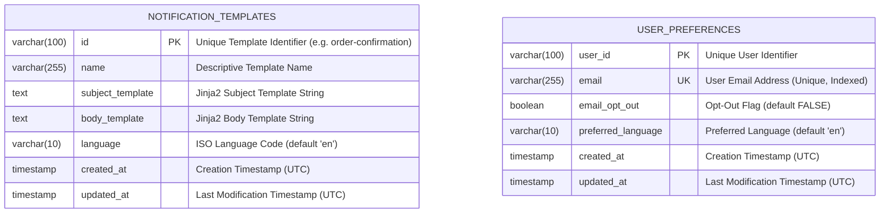
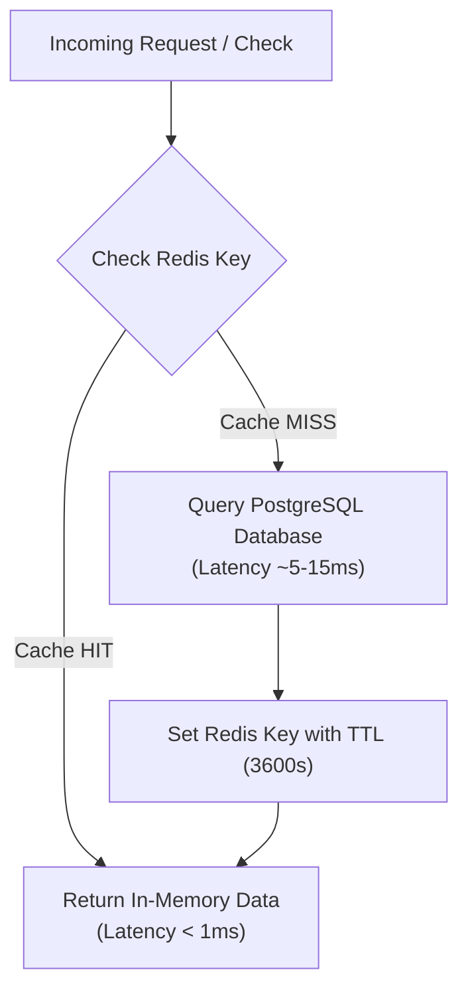
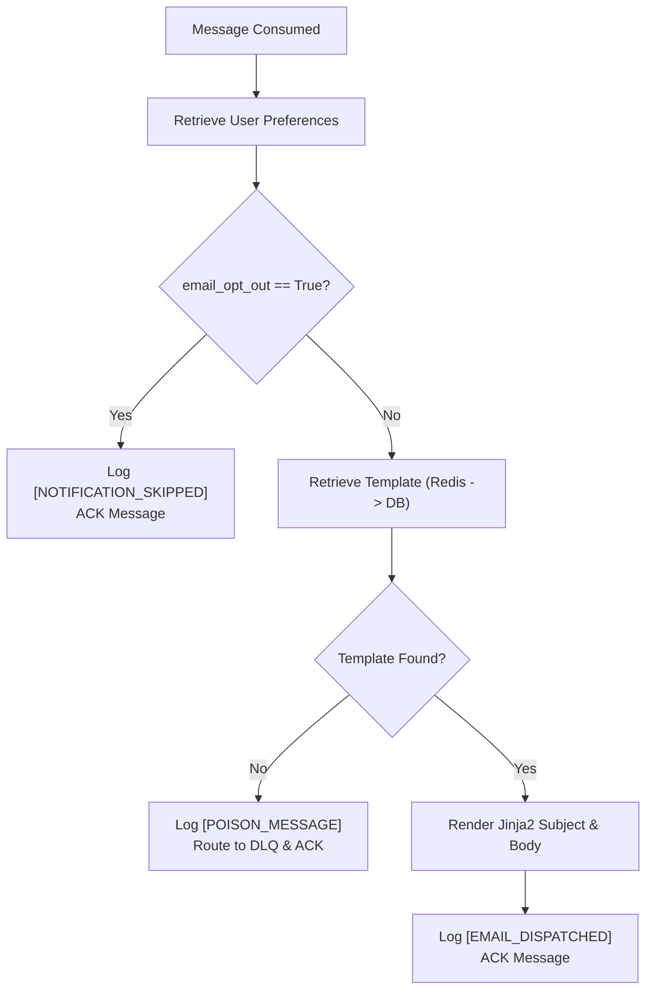
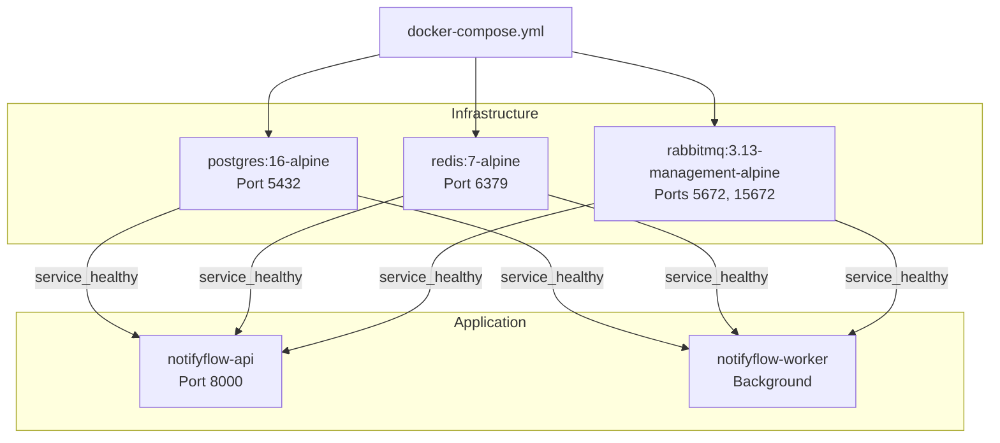

# NotifyFlow: Comprehensive Technical Manual & Project Documentation

## 1. Project Overview & Business Problem

In modern high-scale web platforms (e-commerce, financial services, enterprise SaaS), user actions trigger critical transactional communications—such as **order confirmations**, **password resets**, **payment receipts**, and **security alerts**. 

### 1.1 The Problem with Synchronous Processing
In traditional monolithic architectures, sending an email synchronously within the HTTP request-response lifecycle creates major failure modes:
- **API Latency Degradation**: Waiting for an external email provider or rendering engine introduces hundreds of milliseconds (or seconds) of latency into user-facing operations like checkout.
- **Cascading Failures**: If the email service slows down or becomes unavailable, upstream API threads block, exhausting worker pools and bringing down core services.
- **Database Bottlenecks**: Repeatedly querying static email templates and user preference records on every notification introduces redundant database I/O.
- **Lack of Traffic Regulation**: Without rate limiting, malicious or broken clients can flood notification endpoints, exhausting quota and driving up infrastructure costs.

### 1.2 The NotifyFlow Solution
**NotifyFlow** addresses these challenges through a resilient, event-driven, microservices-based architecture:
- **Decoupled Asynchronous Processing**: The API service accepts the notification request, validates inputs, and publishes a persistent event to **RabbitMQ**, returning an `HTTP 202 Accepted` response in sub-5ms.
- **Distributed In-Memory Caching**: **Redis** serves as a cache-aside layer for frequently accessed templates and user preferences, drastically reducing relational database load.
- **Fair-Usage Rate Limiting**: An atomic Redis rate limiter protects the API by enforcing a configurable sliding-window quota per client IP address.
- **Worker Consumer & Templating Engine**: A dedicated worker consumes messages, evaluates user opt-out preferences, renders personalized messages with **Jinja2**, and simulates dispatch with full poison message safety.

---

## 2. Requirements & Verification Matrix

| Requirement ID | Specification Description | Module Responsible | Status / Verification Method |
|---|---|---|---|
| **REQ-API-01** | Expose `POST /api/notifications/email` accepting JSON payload (`recipient_email`, `template_id`, `dynamic_data`). | API (`notifications.py`) | Verified via Unit & Integration Tests |
| **REQ-API-02** | Validate input payload (strict email format, required fields) and return `HTTP 400` / `422` on errors. | API (`schemas.py`) | Verified via `test_api_validation.py` |
| **REQ-API-03** | Publish persistent notification event to RabbitMQ upon validation. | API (`rabbitmq_service.py`) | Verified via `test_notification_flow.py` |
| **REQ-API-04** | Return `HTTP 202 Accepted` immediately upon queuing with tracking UUID. | API (`notifications.py`) | Verified via `test_api_endpoints.py` |
| **REQ-WRK-01** | Separate Worker service to consume messages from RabbitMQ queue. | Worker (`consumer.py`) | Verified via `test_worker_consumer.py` |
| **REQ-WRK-02** | Simulate email dispatch by logging rendered output to console. | Worker (`consumer.py`) | Verified via console logging logs |
| **REQ-WRK-03** | Manual ACK after processing; poison message protection without infinite loops. | Worker (`consumer.py`) | Verified via `test_worker_handles_missing_template_poison_message` |
| **REQ-DAT-01** | PostgreSQL database storing notification templates and user preferences. | DB (`init-db.sql`) | Verified via Schema & Foreign constraints |
| **REQ-TMP-01** | Dynamic data injection with Jinja2 templating engine. | Worker (`template_engine.py`) | Verified via `test_template_rendering.py` |
| **REQ-CAC-01** | Redis caching for notification templates (`template:<id>`). | Cache (`cache_service.py`) | Verified via `test_caching.py` |
| **REQ-CAC-02** | Redis caching for user preferences (`user_prefs:<email>`). | Cache (`cache_service.py`) | Verified via `test_caching.py` |
| **REQ-RAT-01** | Redis IP-based rate limiting allowing max X requests per minute. | Rate Limiter (`rate_limiter.py`) | Verified via `test_rate_limiter.py` |
| **REQ-RAT-02** | Return `HTTP 429 Too Many Requests` when quota is exceeded. | API (`notifications.py`) | Verified via `test_send_email_notification_rate_limiting` |
| **REQ-DOC-01** | Multi-container Docker Compose setup with health checks for all services. | Docker (`docker-compose.yml`) | Verified via multi-container orchestration |
| **REQ-SED-01** | Automatic database seeding with at least 3 templates and 5 user preferences. | Database (`init-db.sql`) | Verified: 5 templates & 7 preferences seeded |

---

## 3. Database Architecture & Data Models

### 3.1 Entity-Relationship Diagram (ERD)



### 3.2 Data Dictionary

#### Table: `notification_templates`
| Column | Type | Constraints | Default | Description |
|---|---|---|---|---|
| `id` | `VARCHAR(100)` | `PRIMARY KEY` | None | Unique string key (e.g., `order-confirmation`, `password-reset`) |
| `name` | `VARCHAR(255)` | `NOT NULL` | None | Human-readable title of the template |
| `subject_template` | `TEXT` | `NOT NULL` | None | Jinja2 template string for the email subject line |
| `body_template` | `TEXT` | `NOT NULL` | None | Jinja2 template string for the email body |
| `language` | `VARCHAR(10)` | `NOT NULL` | `'en'` | Template localization code |
| `created_at` | `TIMESTAMP WITH TIME ZONE` | `NOT NULL` | `CURRENT_TIMESTAMP` | Timestamp of creation |
| `updated_at` | `TIMESTAMP WITH TIME ZONE` | `NOT NULL` | `CURRENT_TIMESTAMP` | Timestamp of last update |

#### Table: `user_preferences`
| Column | Type | Constraints | Default | Description |
|---|---|---|---|---|
| `user_id` | `VARCHAR(100)` | `PRIMARY KEY` | None | System user UUID or ID string |
| `email` | `VARCHAR(255)` | `UNIQUE`, `NOT NULL`, `INDEX` | None | User's normalized lowercase email address |
| `email_opt_out` | `BOOLEAN` | `NOT NULL` | `FALSE` | When `TRUE`, all non-critical emails are suppressed |
| `preferred_language` | `VARCHAR(10)` | `NOT NULL` | `'en'` | Preferred locale code |
| `created_at` | `TIMESTAMP WITH TIME ZONE` | `NOT NULL` | `CURRENT_TIMESTAMP` | Record creation timestamp |
| `updated_at` | `TIMESTAMP WITH TIME ZONE` | `NOT NULL` | `CURRENT_TIMESTAMP` | Record update timestamp |

---

## 4. In-Memory Caching & Rate Limiting Strategy



### 4.1 Redis Key Namespaces & TTL Policies
| Namespace Pattern | Data Format | TTL | Purpose | Invalidation Triggers |
|---|---|---|---|---|
| `template:<template_id>` | JSON String | 3600s (1 hr) | Caches subject and body template strings | `PUT /api/templates/{id}`, `DELETE /api/templates/{id}` |
| `user_prefs:<email>` | JSON String | 3600s (1 hr) | Caches user opt-out status and language preference | `PUT /api/preferences/{email}` |
| `rate_limit:ip:<ip_address>` | Integer Counter | 60s (1 min) | Tracks request counts per client IP | Automatically expires at end of window |

### 4.2 Rate Limiting Algorithm
1. Extract client IP from `X-Forwarded-For`, `X-Real-IP`, or raw socket address.
2. Execute an atomic Redis pipeline:
   - `INCR rate_limit:ip:<ip_address>`
   - `TTL rate_limit:ip:<ip_address>`
3. If new key, set `EXPIRE 60`.
4. If `current_count > RATE_LIMIT_PER_MINUTE`:
   - Set `Retry-After: <ttl>` header.
   - Return `HTTP 429 Too Many Requests`.

---

## 5. Message Broker & Event-Driven Architecture

### 5.1 RabbitMQ Topology
- **Exchange Name**: `notifications_exchange` (Type: `TOPIC`, Durable: `True`)
- **Queue Name**: `email_notifications` (Durable: `True`)
- **Routing Key**: `notification.email`
- **Dead Letter Exchange**: `notifications_dlx` (Type: `DIRECT`, Durable: `True`)
- **Dead Letter Queue**: `email_notifications_dlq` (Durable: `True`, Bound to DLX with key `dead_letter`)

### 5.2 Event Message Schema
```json
{
  "notification_id": "c71a39f6-6c7b-4d51-8e54-bf63c631a54b",
  "recipient_email": "john.doe@example.com",
  "template_id": "order-confirmation",
  "dynamic_data": {
    "order_id": "ORD-12345",
    "customer_name": "John Doe",
    "product_name": "Pro License",
    "total_amount": 199.00
  },
  "preferred_language": "en",
  "email_opt_out": false,
  "timestamp": "2026-09-28T12:00:00.000000Z"
}
```

---

## 6. Worker Execution & Templating Engine

### 6.1 Jinja2 Templating Features
- **Silent Undefined**: Missing template parameters render safely as empty strings or fallback to defaults (`{{ user_name | default("Valued Customer") }}`) without crashing the worker.
- **Custom Currency Filter**: `{{ total_amount | currency }}` formats numeric values to standard currency representation (e.g., `$199.00`).
- **Autoescaping**: Automatic HTML/XML character escaping prevents XSS and HTML injection in transactional email bodies.

### 6.2 Opt-Out Decision Tree


---

## 7. Testing & Verification Suite

The service includes comprehensive test suites implemented in **Pytest** and **Pytest-Asyncio**:

### 7.1 Test Distribution
```
tests/
├── conftest.py              # In-memory SQLite async engine & Mock Redis fixtures
├── unit/
│   ├── test_api_validation.py      # Schema validation (6 tests)
│   ├── test_rate_limiter.py       # Redis rate limiting & multi-IP isolation (4 tests)
│   ├── test_caching.py            # Cache hit/miss & invalidation (3 tests)
│   ├── test_template_rendering.py # Jinja2 filters & safe escaping (4 tests)
│   └── test_worker_consumer.py    # Opt-out & poison message recovery (4 tests)
└── integration/
    ├── test_api_endpoints.py      # Health, notifications, template/pref CRUD (7 tests)
    └── test_notification_flow.py  # End-to-end event flow (1 test)
```

### 7.2 Running Tests
```bash
# Run all tests locally
python -m pytest -v

# Run with test coverage report
python -m pytest --cov=api --cov=worker
```

---

## 8. Deployment, Operations & Runbook

### 8.1 Docker Compose Service Map


### 8.2 Operational Health Checks
- **API Health Endpoint**: `http://localhost:8000/health`
- **RabbitMQ Management UI**: `http://localhost:15672` (Username: `guest`, Password: `guest`)
- **Worker Heartbeat**: Inspected automatically by Docker container probe at `/tmp/worker_heartbeat`.

### 8.3 Troubleshooting Matrix
| Symptom | Probable Cause | Diagnostic Command / Resolution |
|---|---|---|
| `503 Service Unavailable` on `/health` | RabbitMQ, Redis, or PostgreSQL container starting | Check `docker-compose ps` to verify container health statuses |
| `429 Too Many Requests` | IP exceeded configured rate limit | Inspect `Retry-After` header or increase `RATE_LIMIT_PER_MINUTE` in `.env` |
| `400 Bad Request: Template not found` | Requested `template_id` does not exist in DB | List available templates via `GET /api/templates` or create it via `POST /api/templates` |
| Notification skipped in worker logs | User has opted out of notifications | Update opt-out setting via `PUT /api/preferences/{email}` with `{"email_opt_out": false}` |
